 title:
tags:
notebook:C Programming

# MOOC浙大翁凯C语言程序设计

## 目录

[TOC]

### 10.1 字符串

字符数组：`char word[] = {'H', 'e', 'l', 'l', 'o', '!'};`

字符串：`char word[] = {'H', 'e', 'l', 'l', 'o', '!', '\0'};`

- 对c语言来说，字符串指的是以0（整数0）结尾的一串字符
    - 0或‘\0’是一样的，但是和‘0’不同
- 0标志着字符串的结束，但它不是字符串的一部分
    - 计算字符串长度的时候不包含这个0
- 字符串以数组的形式存在，以数组或指针的形式访问
    - 更多地是以指针的形式
- `string.h`里有很多处理字符串的函数

字符串变量：

- char *str = "Hello";
- char word[] = "Hello";
- char line[10] = "Hello";

字符串常量/字面量

- "Hello"
- "Hello"会被编译器变成一个字符数组放在某处，这个数组的长度是6，结尾还有表示结束的0
- 两个相邻的字符串常量会被自动连接起来

C语言的字符串是以数组的形态存在的

- 不能用运算符对字符串做运算
- 通过数组的方式可以遍历字符串

字符串在C语言唯一特殊的地方是可以用双引号这种字符串字面量来初始化字符数组，C语言的标准库提供了一系列字符串函数

#### 字符串变量

```c
char *s = "Hello, word!";
```

- `s`是一个指针，初始化为指向一个字符串常量

    - 由于这个常量所在的地方为程序代码段，只能读不能写，所以实际上`s`是`const char *s`，但是由于历史原因，编译器接收不带const的写法
    - 但是试图对`s`所指的字符串做写入会导致严重的后果

- 如果需要修改字符串，应该在一开始就用数组：

    ```c
    char s[] = "Hello, word!";
    ```

    当定义数组时，系统会先在代码段创建一个字符串，然后通过系统程序将创建的字符串拷贝到当前的数组变量里面，用户可以对数组变量里面的字符串进行修改。

**指针还是数组**

- 数组：表示这个字符串就在这里
    - 它作为本地变量，空间会自动被回收
- 指针：表示这个字符串不知道在哪里
    - 作只读字符串，不会去写入它
    - 处理参数（比如数组作为函数参数传进来时，就可以看作是指针）
    - 动态分配空间

==如果要构造一个字符串—>数组==

==如果要处理一个字符串—>指针==

##### char *

- 字符串可以表达为`char *`的形式
- `char *`不一定是字符串
    - 它只是表示指向字符的指针，即这里有一个指针，指向一个字节或者一串连续的字节。可能指向的是字符型的数组（就像`int *`一样）
    - 只有它所指的字符数组有结尾的0时，才能说它所指的是字符串

#### 字符串输入输出

```c
char string[8];
scanf("%s", string);
printf("%s", string);
```

- `scanf`读入一个单词（到空格、tab或回车为止，不包括空格，空格只是用来分隔两个字符串的）

- `scanf`是不安全的，因为不知道要读入的内容的长度

    - 在%和s中间加上最多读入字符的个数，这个数字应该比数组大小小一

        ```c
        scanf("%7s", string);
        ```

    - 下一次`scanf`会取前一个`scanf`取剩下的字符，并根据给定字符个数取剩下的字符

##### 常见错误

- 以为`char *`是字符串类型，定义了一个字符串类型的变量string就可以直接用了
    - `char *string;`只是表示定义了一个指针变量，将来要指向某个内存空间的指针，但在一开始该指针没有被初始化
    - 由于没有对string初始化为0，就导致不是每次运行都出错（有可能出现在这台电脑上可以运行，到另一台电脑上就出错的情况）
- 空字符串
    - `char buffer[100] = "";`
        - 这是一个空字符串，buffer[0] == '\0'
    - `char buffer[] = "";`
        - 长度为1，只有一个buffer[0]，里面放不下任何字符串

#### 字符串数组

- ```c
    char **a
    ```

    - a是一个指针，指向另一个指针，那个指针指向一个字符（串）

- ```c
    char a[][]
    ```

    - 二维数组的列需要有具体的数值，否则编译无法通过

    - 可定义成`char a[][10]`

        - 意思是`a`是一个数组，该数组里面的每一个单元都是一个`char[10]`，`a[0]`相当于`char [10]`
        - ==用这种方式定义时，需要确定每个字符串的长度，若里面有单元长度超过10，就会编译失败==

        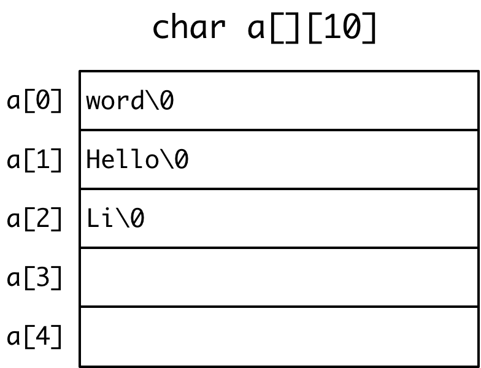

- ```c
    char *a[]
    ```

    - 在这种字符串数组中，`a[0]`相当于`char *`

    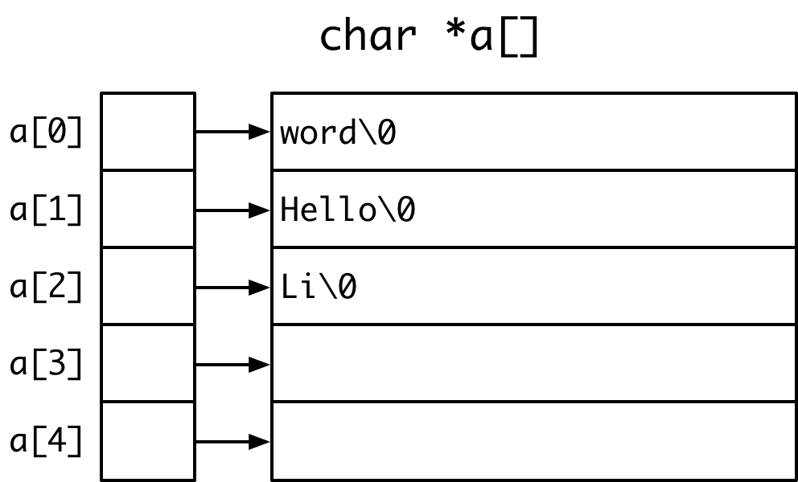

##### 程序参数

- `main`函数的参数

    ```c
    int main(int argc, char const *argv[])
    ```

    - `argc`是用来告诉用户后面的`argv[]`数组有多少个字符串

- `argv[0]`是命令本身

    - 当使用Unix的符号链接时，反映符号链接的名字

    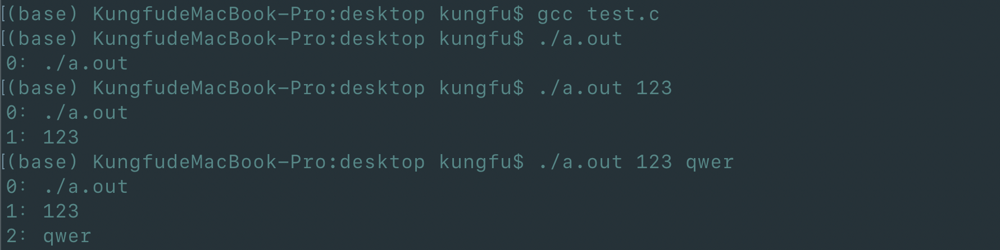

    - 执行`a.out`时，命令行中输入的东西会依次放入`argv[]`数组中

- 若将一个链接`my`指向`a.out`

    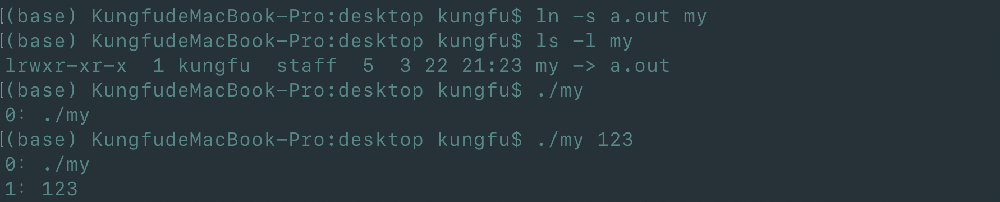

    - 此时如果执行`./my`，实际上是通过`my`这个链接来执行的`a.out`，而不是直接执行的`./a.out`
    - 可以通过查看`argv[]`数组来确认程序执行的方式

### 10.2 字符串函数

#### 单字符输入输出

##### putchar

```c
int putchar(int c);
```

- 向标准输出写入一个字符
- 返回写了几个字符，EOF (end of file)（-1）表示写失败

##### getchar

```c
int getchar(void);
```

- 从标准输入读入一个字符
- 返回类型时int，是为了返回EOF （-1）
    - windows —>按Ctrl+Z就可以收到EOF
    - Unix—>按Ctrl+D就可以收到EOF

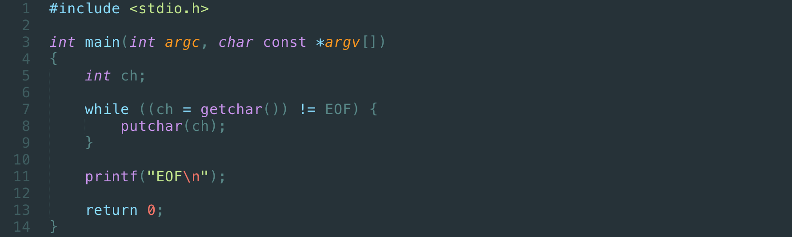

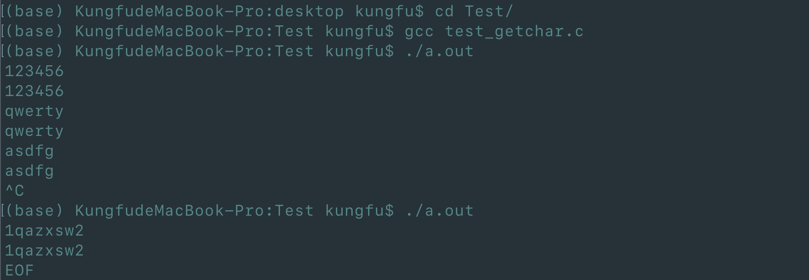

#### 函数STRLEN

##### string.h

- ```c
    #include <string.h>
    ```

##### strlen

```c
size_t strlen(const char *s);
```

- 返回s的字符长度（不包括结尾的0）

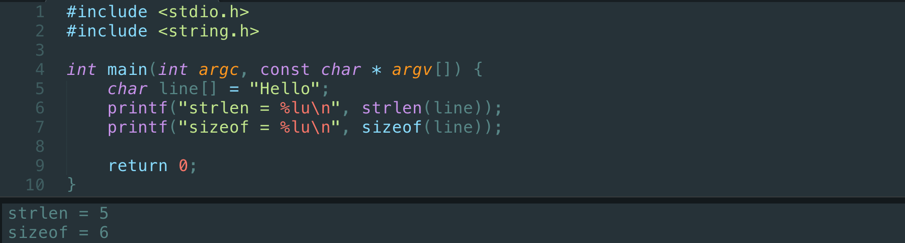

**自己写一个输出字符串长度的函数**

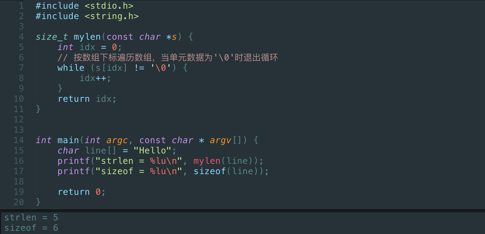

#### 函数STRCMP

```c
int strcmp(const char *s1, const char *s2);
```

- 比较两个字符串，返回：
    - 0：s1 == s2
    - 大于0：s1 > s2，输出s1-s2的差值
    - 小于0：s1 < s2，输出s1-s2的差值

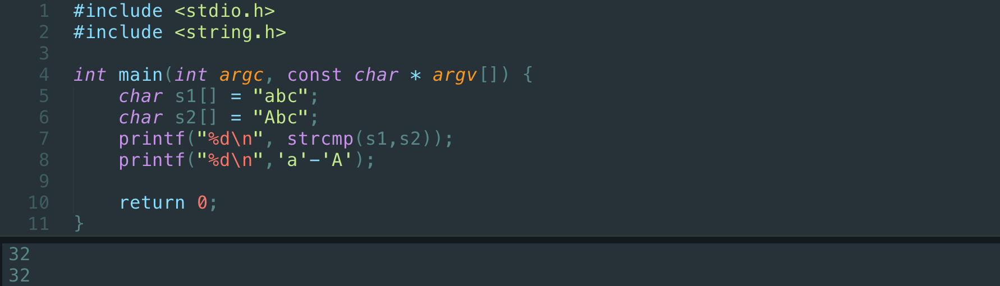

**自己写一个比较字符串的函数**

```c
// 数组版本
int mycmp(const char *s1, const char *s2) {
    int idx = 0
    while ((s1[idx] == s2[idx]) && (s1[idx] != '\0')) {
		idx++;
    }
    return s1[idx] - s2[idx];
}
```

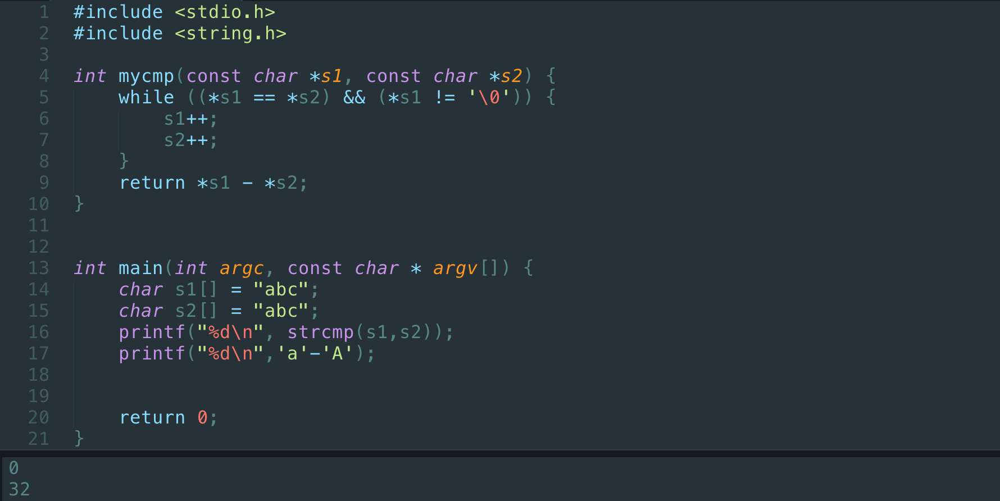

#### 函数STRCPY

```c
char *strcpy(char *restrict dst, const char *restrict src)
```

- 把src的字符串拷贝到dst
    - restrict表明src和dst不能重叠（C99）
- 返回dst
    - 为了能将代码链起来

##### 复制一个字符串

```c
char *dst = (char *)malloc(strlen(src) + 1); // 先动态分配内存
strcpy(dst, src);
```

**自己写一个拷贝字符串函数**

```c
// 数组版本
char *mycpy(char *dst, const char *src) {
    int idx = 0;
    while (src[idx] != '\0') {
        dst[idx] = src[idx];
        idx++;
    }
    dst[idx] = '\0';
    return dst;
}
```

```c
// 指针版本
char *mycpy(char *dst, const char *src) {
    char *ret = dst;	// 保证返回dst
    while (*src != '\0') {
        *dst = *src;
        dst++;
        src++;
    }
    *dst = '\0';
    return rst;
}
```

```c
// 指针版本_简化
char *mycpy(char *dst, const char *src) {
    char *ret = dst;	// 保证返回dst
    while (*src) {
        *dst++ = *src++;
    }
    *dst = '\0';
    return rst;
}
```

```c
// 指针版本_再简化
char *mycpy(char *dst, const char *src) {
    char *ret = dst;	// 保证返回dst
    while ( *dst++ = *src++) 
        ;
    *dst = '\0';
    return ret;
}
```

#### 函数STRCAT

```c
char *strcat(char *restrict s1, const char *restrict s2);
```

- 把s2拷贝到s1的后面，接成一个长的字符串
- 返回s1
- s1必须具有足够的空间

#### 安全问题

- strcpy和strcat都有可能出现安全问题
    - 如果目的地没有足够的空间，就会出错

##### 安全版本

```c
char *strncpy(char *restrict dst, const char *restrict src, size_t n);
```

```c
char *strncat(char *restrict s1, const char *restrict s2, size_t n);
```

```c
int strncmp(const char *s1, const char *s2, size_t n);
```

#### 字符串搜索函数

##### 字符串中找字符

```c
char *strchr(const char *s, int c);	// 在s中找从左边数过来c第一次出现的位置
```

```c
char *strrchr(const char *s, int c);	// 在s中找从右边数过来c第一次出现的位置
```

- 返回的是指针，指向所找的字符
- 返回NULL表示没有找到

**找第二个字符**

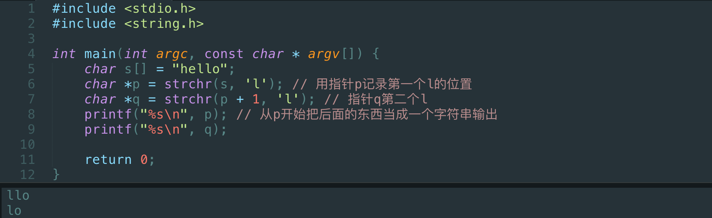

**找到字符并将该字符以及该字符以后的东西复制到另一个字符串中去**

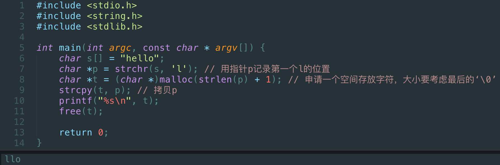

**输出所找字符前面的字符串，不包括该字符**

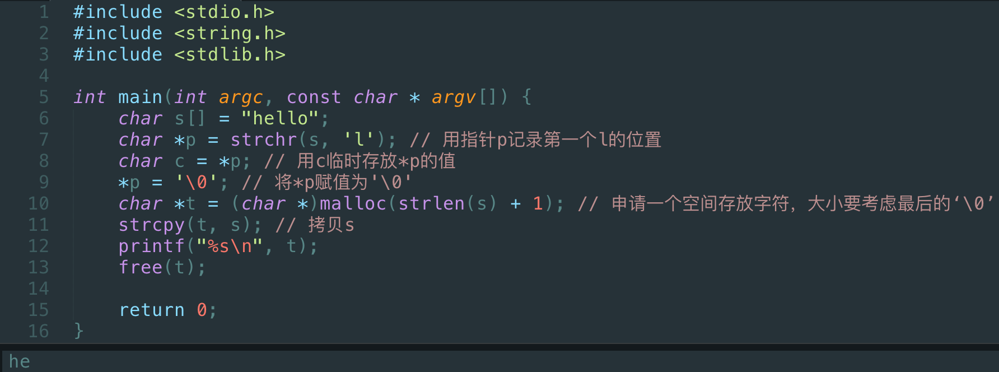

##### 字符串中找字符串

```c
char *strstr(const char *s1, const char *s2);
```

```c
char *strcasestr(const char *s1, const char *s2);	// 忽略大小写
```

### 11.1 枚举

- 枚举是一种用户定义的数据类型，它用关键字eume以如下语法来声明

    - `enum枚举类型名字{ 名字0, ……, 名字n };`

- 枚举类型名字通常并不真的使用，要用的是大括号里面的名字，因为它们就是常量的符号，它们的类型时int，值则是依次从0到n。如：

    ```c
    enum colors {red, yellow, green};
    ```

    - red的值是0，yellow是1，green是2

- 当需要一些可以排列起来的常量值时，定义枚举的意义就是给了这些常量值名字

```c
#include <stdio.h>

enum color {red, yellow, green};	// 声明一个叫color的新的数据类型，类似int，float

void f(enum color c);	// 用的时候必须带上enum

int main(void) {
    enum color t = red;
    
    scanf("%d", &t);
    f(t);
    
    return 0;
}

void f(enum color c) {
    printf("%d\n", c);
}
```

- 实际上C语言内部，枚举就是以整数来做内部计算和外部输入输出的

##### 套路：自动计数的枚举

```c
enum COLOR {RED, YELLOW, GREEN, NumCOLORS};
```

- 在枚举的最后加上一个变量，作为所有元素个数就计数总和

**声明枚举量的时候可以指定值**

```c
enum COLOR 
{
    RED = 1, 
    YELLOW, 	// YELLOW为2
    GREEN = 5	// 跳过了3和4
};
```

- 虽然枚举类型可以当做类型使用，但是实际上很(bu)少(hao)用
- 如果遇到一些列有意义的排比的数字，用枚举比const int 方便
- 枚举比宏（macro）好，因为枚举有int类型

### 11.2 结构

#### 结构类型

##### 声明结构类型

- 形式一

    ```c
    struct point {
        int x;
        int y;
    };
    
    struct point p1, p2;
    ```

    - p1，p2都是point类型的结构体变量，里面都有x和y的值

- 形式二

    ```c
    struct {
        int x;
        int y;
    } p1, p2;
    ```

    - p1，p2都是无名结构，里面都有x和y的值

- 形式三

    ```c
    struct point {
        int x;
        int y;
    } p1, p2;
    ```

    - p1，p2都是point类型的结构体变量，里面都有x和y的值

==对于第一种和第三种形式，都声明了结构point。但是第二种形式没有声明point，只是定义了两个变量==

##### 在函数内/外？

- 和本地变量一样，在函数内部声明的结构类型只能在函数内部使用
- 所以通常在函数外部声明结构类型，这样就可以被多个函数所使用的了

##### 结构变量

```c
struct date {
    int month;
    int day;
    int year;
};
```

- 这只是在声明一个名为data的结构类型

```c
struct date today;
```

- today才是一个具体的结构变量

##### 结构的初始化

```c
#include <stdio.h>

struct date {
    int month;
    int day;
    int year;
};

int main(int argc, const char * argv[]) {
    struct date today = {3, 24, 2020};
    // 未初始化的值默认为0
    struct date thismonth = {.month = 3, .year = 2020};

    printf("Today's date is %i-%i-%i.\n",
    	today.year, today.month, today.day);
    printf("This month is %i-%i-%i.\n",
    	thismonth.year, thismonth.month, thismonth.day);
    
    return 0;
}
```

##### 结构成员

- 结构和数组有点像
- 内容
    - 数组里的单元必须是相同类型的
    - 结构的成员可以是不同类型的
- 访问
    - 数组用`[]`运算符合下标访问其成员
        - `a[0] = 10;`
    - 结构用 `.` 运算符和名字访问其成员
        - `today.day`
        - `student.firstName`
        - `p1.x`
        - `p2.y`

##### 结构运算

- 要访问整个结构，直接用结构变量的名字

- 对于整个结构，可以赋值、取地址，也可以传递给函数参数

    - ```c
        p1 = (struct point){5, 10};	// 相当于p1.x = 5; p1.y = 10;
        ```

        将{5, 10}强制转换成point类型的结构，并赋值给p1

    - ```c
        p1 = p2; // 相当于p1.x = p2.x; p1.y = p2.y;
        ```

    ==数组无法做这两种运算==

##### 结构指针

- 和数组不同，结构变量的名字并不是结构变量的地址，必须使用&运算符取地址给指针

- ```c
    int a[] = {1,2,3};
    int *p = a;	// p可以取到数组a的地址，相当于int *p = &a;
    ```

- ```c
    struct date today = {3, 24, 2020};
    struct date *pDate = &today;
    ```

#### 结构与函数

##### 结构作为函数参数

```c
int numberOfDays(struct date d)
```

- 整个结构可以作为参数的值传入函数
- 这个时候是在函数内部新建了一个结构变量，并复制调用者的结构的值，与数组不同
- 函数也可以返回一个结构

==这些都和数组不同==

**【例题】：计算tomorrow**

```c
#include <stdio.h>
#include <stdbool.h>

struct date {
    int month;
    int day;
    int year;
};

bool isLeap(struct date d);
int numberOfDays(struct date d);

int main(int argc, const char * argv[]) {
    struct date today, tomorrow;
    
    printf("Enter today's day (mm dd yyyy):");
    scanf("%i %i %i", &today.month, &today.day, &today.year);
    
    if (today.day != numberOfDays(today)) {
        tomorrow.day = today.day + 1;
        tomorrow.month = today.month;
        tomorrow.year = today.year;
    } else if (today.month == 12) {
        tomorrow.day = 1;
        tomorrow.month = 1;
        tomorrow.year = today.year + 1;
    } else {
        tomorrow.day = 1;
        tomorrow.month = today.month + 1;
        tomorrow.year = today.year;
    }
    
    printf("Tomorrow's date is %i-%i-%i.\n",
           tomorrow.year, tomorrow.month, tomorrow.day);
    
    return 0;
}

// 判断today是不是本月的最后一天
int numberOfDays(struct date d) {
    int days;
    
    const int daysPerMonth[12] = {31, 28, 31, 30, 31, 30, 31, 31, 30, 31, 30, 31};
    
    // 闰年的二月是29天
    if ((d.month == 2) && isLeap(d)) {
        days = 29;
    } else {
        days = daysPerMonth[d.month - 1];   // 数组下标从0开始，取对应月份天数需减一
    }
    
    return days;
}

// 判断本年是不是闰年
bool isLeap(struct date d) {
    bool leap = false;
    
    if (((d.year % 4 == 0) && (d.year % 100 != 0)) || (d.year % 400 == 0)) {
        leap = true;
    }
    
    return leap;
}
```

##### 输入结构

- 没有直接的方式可以一次scanf一个结构

- 如果直接传

    ```c
    #include <stdio.h>
    
    struct point {
        int x;
        int y;
    };
    
    void getStruct(struct point);
    void output(struct point);
    void main() {
        struct point t = {0, 0};
        getStruct(t);
        output(t);
    }
    
    void getStruct(struct point p) {
        scanf("%d", &p.x);
        scanf("%d", &p.y);
        printf("%d %d", p.x, p.y);
    }
    
    void output(struct point p) {
        printf("%d %d", p.x, p.y);
    }
    ```

    - `getStruct`函数中的p和`main`中的y是不同的，在函数读入了p的值以后，没有任何东西回到`main`，所以y还是`{0, 0}`，不会变成输入的值。
    - 问题在于，传入函数的是外面那个结构的克隆体，而不是指针；这与数组做参数传给函数是不同的

- 解决方案一

    - 在这个输入函数中，完全可以创建一个临时的结构变量，然后把这个结构返回给调用者

        ```c
        #include <stdio.h>
        
        struct point {
            int x;
            int y;
        };
        
        struct point getStruct(void); // 让getStruct不接受参数，并返回一个point型的变量
        void output(struct point);
        void main() {
            struct point y = {0, 0};
            y = getStruct(); // 用y接收getStruct返回的变量
            output(y);
        }
        
        struct point getStruct(void) {
            struct point p;	// 内部定义一个point型的变量
            scanf("%d", &p.x);
            scanf("%d", &p.y);
            printf("%d %d", p.x, p.y);
            return p; // 返回p，并且在离开函数时清除变量p
        }
        
        void output(struct point) {
            printf("%d %d", p.x, p.y);
        }
        ```

    - 这种方法既费时间又费空间

- 解决方案二

    - 结构指针做为参数
    - K & R (P131)
        - “If a large structure is to be passed to a function, it is generally more efficient to pass a pointer than to copy the whole structure.”

##### 指向结构的指针

```c
struct date *p = &myday; // 定义了一个指针p指定myday，即p指向myday的地址
(*p).month = 12; // 取p所指结构变量的month，并赋值为12
// 等价于
p->month = 12;
```

- 用`->`表示指针所指的结构变量中的成员

```c
#include <stdio.h>

struct point {
    int x;
    int y;
};

struct point *getStruct(struct point *); // getStruct返回的是指针，接收的也是指针

// 两种输出方式
void output(struct point);  // 接收结构体，并输出当前结构体内各成员的值
void print(const struct point *p); // 接收指向结构体的指针，并输出当前结构体内各成员的值

int main() {
    struct point t = {0, 0};
    getStruct(&t); // 将t的地址传给getStruct的指针做运算，并返回指向该结构体的指针
    output(t); // 传结构体
    print(getStruct(&t)); // 传指向结构体的指针
    return 0;
}

struct point *getStruct(struct point *p) {
    scanf("%d", &p->x);
    scanf("%d", &p->y);
    return p;
}

void output(struct point p) {
    printf("%d %d\n", p.x, p.y);

}

void print(const struct point *p) {
    // const表明print不会对传入参数做任何修改
    printf("%d %d\n", p->x, p->y);
}
```

#### 结构中的结构

##### 数组中的结构

```c
struct date dates[100];	// 有一个数组dates由100个date类型的结构变量组成
struct date dates[] = {
    {4,5,2005},
    {2,4,2005},
}; // 注意这里的分号
```

##### 结构中的结构

```c
struct dateAndTime {
    struct date sdate;
    struct time stime;
};
```

##### 嵌套的结构

**矩形**

```c
struct point {
    int x;
    int y;
};

struct rectangle {
    struct point pt1;
    struct point pt2;
};
```

如果有变量`struct rectangle r;`，就可以有：`r.pt1.x`、`r.pt1.y`、`r.pt2.x`、`r.pt2.y`

如果有指针变量定义:

```c
struct rectangle r;
struct rectangle *rp;
rp = &r;
```

则下面四种表达形式是等价的

```c
r.pt1.x
rp->pt1.x
(r.pt1).x
(rp->pt1).x  
// 但是没有rp->pt1->x，因为pt1不是指针
```

### 11.3 联合

#### 类型定义

##### 自定义数据类型(typedef)

- C语言提供了一个叫做==typedef==的功能来声明一个已有的数据类型的新名字。比如:

    ```c
    typedef int Length;
    ```

    - 使得`Length`成为`int`类型的别名
    - 这样的话，Length这个名字就可以代替int出现在变量定义和参数声明的地方了：
        - `Length a, b ,len;`
        - `Length numbers[10];`

##### Typedef

```c
typedef struct ADate { // 在typedef和最后单词Date中间的所有的东西，是原来的类型
    int month;
    int day;
    int year;
} Date; // Date是新的名字，新名字只能是一个单词
```

- 改善了程序的可读性

如：

```c
typedef *char[10] Strings; // Strings是10个字符串的数组的类型
```

#### 联合

```c
union AnElt {
    int i;
    char c;
} elt1, elt2; // elt1和elt2占据的是同一个内存空间

elt1.i = 4;
elt2.c = 'a'; // 存在互相覆盖内存空间的情况
```

**【例题】**

用union得到一个整数内部的各个字节

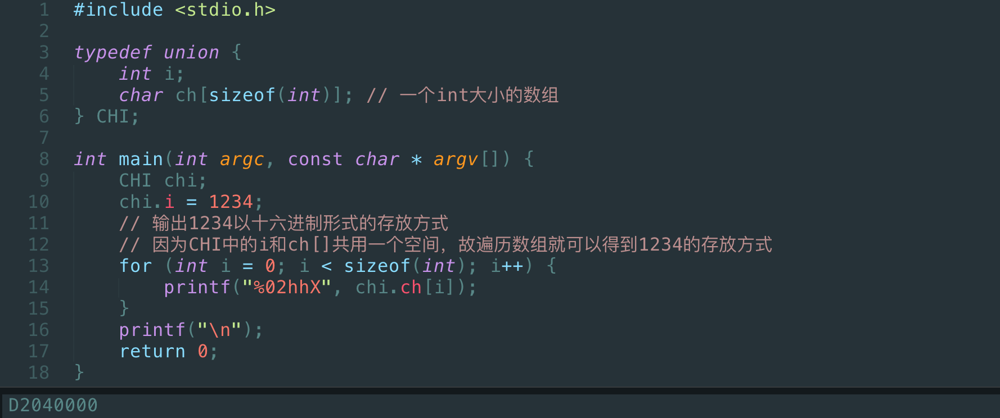

- 以低位在前方式存放，实际为`000004D2`

### 12.1 全局变量

#### 全局变量

- 定义在函数外面的变量是全局变量
- 全局变量具有全局的生存期和作用域
    - 它们与任何函数都无关
    - 在任何函数内部都可以使用它们

##### 全局变量初始化

- 没有初始化的全局变量会得到0值

    - 指针会得到NULL值

- 只能用***编译时刻已知的值***来初始化全局变量

    ```c
    int gAll = f();
    ```

    - `f()`不符合❌

    ```c
    int gAll = 12;
    int g2 = gAll;
    ```

    - `gAll`只能识别为变量，也不符合❌

    ```c
    const int gAll = 12;
    int g2 = gAll;
    ```

    - `gAll`被定义成12，符合条件，但***不建议用一个全局变量去初始化另一个全局变量⚠️***

- 它们的初始化发生在main函数之前

##### 被隐藏的全局变量

- 如果函数内部存在于全局变量同名的变量，则全局变量被隐藏（取代）

#### 静态本地变量

- 在本地变量定义时加上`static`修饰符就成为静态本地变量

- 当函数离开的时候，静态本地变量会继续存在并保持其值

- 静态本地变量的初始化***只会在第一次进入***这个函数时做，以后进入函数会保持上次离开时的值

    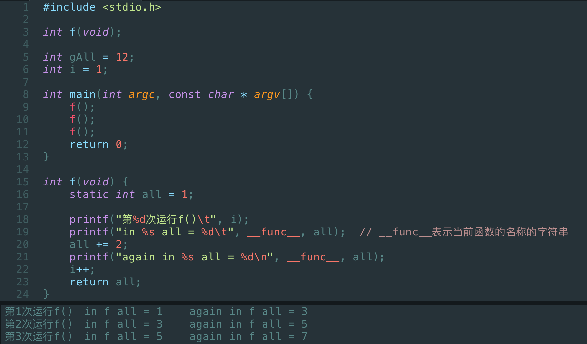

- 静态本地变量实际上是特殊的全局变量

- 它们位于相同的内存区域

    

    - 可以看到静态本地变量和全局变量在同一个内存区域，普通本地变量在另一个内存区域

- 静态本地变量具有全局的生存期，函数内的局部作用域

    - static在这里的意思是局部作用域（本地可访问），即只能在这个函数里面可以访问它

#### 全局变量贴士

##### *返回指针的函数

- 返回本地变量的地址是危险的
- 返回全局变量或静态本地变量的地址是安全的的
- 返回在函数内malloc的内存是安全的的，但容易造成问题
- 最好的做法是返回传入的指针

##### tips

- 不要使用全局变量来在函数间传递参数和结果
- 尽量避免使用全局变量
    - 丰田汽车的案子
- *使用全局变量和静态本地变量的函数是线程不安全的

### 12.2 编译预处理和宏

##### 编译预处理指令

- #开头的是编译预处理指令

- 编译预处理指令不是C语言的成分，但是C语言程序离不开它们

- **#define用来定义一个宏**

    ```c
    #include <stdio.h>
    
    #define PI 3.14159 // 在编译之前会先做一次编译预处理，将所有的PI替换成3.14159
    
    int main(int argc, char const *argv[])
    {
    	printf("%f\n", 2 * PI *3.0);
    	return 0;
    }
    ```

    - `gcc --save-temps main.c`会保留编译过程当中的临时文件

    - `.c`经过编译预处理，产生一个中间结果文件`.i`

        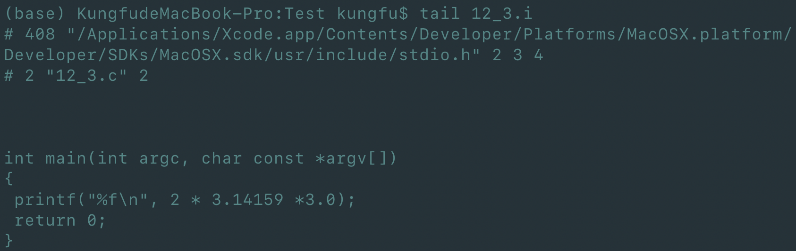

        - `PI` 被替换成了`3.14159`

    - `.i`由C的编译器编译，产生一个`.s`的汇编代码文件

    - `.s`做汇编，变成一个目标代码文件`.o`

    - 目标代码文件经过链接等其他操作，最后形成`a.out`

- ==注意结尾没有分号==，以为这不是Cd语句
- 名字必须是一个单词，值可以是各种东西
- 在C语言的编译器开始编译之前，编译预处理程序（cpp）会把程序中的名字换成值
  
    - 完全的文本替换
- `gcc --save-temps`

##### 宏

- 如果一个宏的值中有其他宏的名字，也会被替换

- 如果一个宏的值超过一行，最后一行之前的行末需要加\

    ```c
    #define PRT printf("%f ", PI); \
    			printf("%f\n", PI2)
    ```

- 宏的值后面出现的注释不会被当作宏的值的一部分

##### 没有值的宏

```c
#define _DEBUG
```

- 这类宏是用于条件编译的，后面有其他的编译预处理指令来检查这个宏是否被定义过了

##### 预定义的宏

- `__LINE__` ：源代码文件的行号，即当前指令所在行的行号
- `__FILE__` ：源代码文件的文件名，包括文件路径
- `__DATE__` ：编译时的日期
- `__TIME__`  ：编译时的时间
- `__STDC__` ：

#### 带参数的宏

##### 像函数的宏

```c
#include <stdio.h>

#define cube(x) ((x) * (x) * (x))

int main(int argc, const char * argv[]) {

    printf("%d\n", cube(5)); // 用5替换x，再用5*5*5替换cube(5)
    return 0;
}
```

##### 带参数的宏的定义原则

- 一切都要括号

    - 整个宏的值要有括号
    - 参数出现的每个地方都要括号

- ```c
    #define RADTODEG(x) ((x) * 57.29578)
    ```

**补充**

- 带参数的宏在大型的代码中使用非常普遍
    - 当它去代替函数时，它的运行效率会比函数来得高
    - 但是由于它导出展开，会导致代码变多，牺牲空间换取了效率
- `#` 和 `##` 都是宏的运算符
    - 甚至可以产生新的函数
- 宏的缺点：在参数的使用中，没有任何类型检查；容易出现类型使用无法检查的问题
    - 可以用inline机制取代带参数的宏
    - inlin是函数，但是没有函数调用时的额外开销，会做参数类型的检查

##### 其他编译与处理指令

- 条件编译
- error
- ……

### 12.3 大程序结构

#### 多个源代码文件   

##### 多个.c文件

- main()函数里面代码太长了适合分成几个函数
- 一个源代码文件太长了适合分成几个文件
- 两个独立的源代码文件不能编译成可执行的程序

#### 项目

- 在Dev C++中新建一个项目，然后把几个源代码文件加进去
- 对于项目，Dev C++的编译会把一个项目中所有的源代码文件都编译后，链接起来
- 有的IDE有分开的编译和构建两个按钮，前者是对单个源代码文件编译，后者是对整个项目做链接

##### 编译单元

- 一个.c文件是一个编译单元
- 编译器每次编译只处理一个编译单元

#### 头文件

- 把函数原型放到一个头文件（以`.h`结尾）中，在需要调用这个函数的源代码文件（`.c`文件）中`#include`这个头文件，就能让编译器在编译的时候知道函数的原型

- 在使用和定义这个函数的地方都应该`#include`这个头文件

- 一般的做法就是任何`.c`都有对应的同名的`.h`，把所有对外公开的函数的原型和全局变量的声明都放进去

    - max.h

        ```c
        // max.h
        int max(int a, int b);	// max()的函数原型
        ```

    - main.c

        ```c
        // main.c
        #include <stdio.h>
        #include "max.h"	//编译预处理时会被替换成max()的函数原型
        
        int main(int argc, const char * argv[]) {
            
            int a = 5;
            int b = 6;
            printf("%d\n", max(a, b));
            
            return 0;
        }
        ```

    - max.c

        ```c
        // max.c
        #include "max.h	// 用来判断对max()的定义是否符合有文件
        
        int max(int a, int b) {
            return a > b ? a : b;
        }
        ```

##### #include

- `#include`是一个编译预处理指令，和宏一样，在编译之前就出来了

- 它会把头文件的全部内容原封不动的插入到它所在的地方

    - 所以也不一定要在.c文件的最前面`#include`

        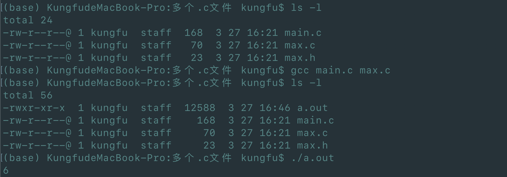

        - `gcc`可以同时编译多个`.c`文件

        - `gcc --save-temps main.c -c `只对main.c做编译，不做链接 

        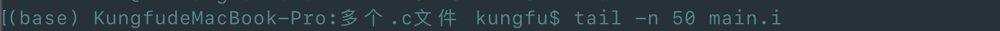

        - 查看`main.i`的最后50行

        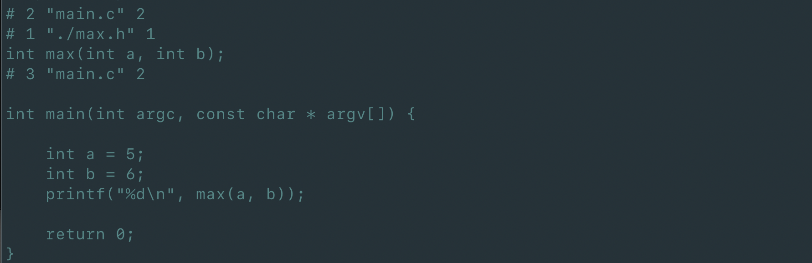

        - 在`main.c`的第二行放入`max.h`，`max.h`第一行的内容是`int max(int a, int b);`

##### ""还是<>

- `#includ`有两种形式来指出要插入的文件
    - `“ ”`：要求编译器首先在当前目录（.c文件所在的目录）寻找这个文件，如果没有，到编译器指定的目录找
    - `<>`：让编译器只在系统指定的目录去找
    - 一般来说：自己写的头文件用`" "`，系统标准库的头文件用`<>`
- 编译器自己知道自己标准库的头文件在哪里
- 环境变量和编译器命令行参数也可以指定寻找头文件的目录

##### #include的误区

- `#include`不是用来引入库的，这种说法不正确
    - `#include`其实只是将它后面那个头文件所包含的内容原封不动的插入到它所在的那一行来
- `stdio.h`里面只有printf的原型，printf的代码在另外的地方，某个.lib(Windows )或.a(Unix)中
- 现在的C语言编译器默认会引入所有的标准库
- `#include <stdio.h>` 只是为了让编译器知道printf函数的原型，保证调用时给出的参数值是正确的类型

##### 不对外公开的函数

- 在函数前面加上static就使得它成为只能在所在的编译单元(.c文件)中被使用的函数
- 在全局变量前面加上static就使得它成为只能在所在的编译单元(.c文件)中被使用的全局变量

#### 声明

如果在max.c中定义一个int型全局变量gAll，想在main.c中使用这个变量，就需要在max的头文件mac.h中声明gAll

```c
// max.h
int max(int a, int b);	// max()的函数原型
entern int gAll;	// 声明gAll
```

```c
// max.c
#include "max.h	// 用来判断对max()的定义是否符合有文件

int gAll = 12;	// 定义gAll

int max(int a, int b) {
    return a > b ? a : b;
}
```

```c
// main.c
#include <stdio.h>
#include "max.h"	//编译预处理时会被替换成max()的函数原型

int main(int argc, const char * argv[]) {
    
    int a = 5;
    printf("%d\n", max(a, gAll));	// 直接使用gAll
    
    return 0;
}
```

##### 变量的声明

- `int i;` 是变量的定义

- `entern int i;` 是变量的声明

##### 声明和定义

- 声明是不产生代码的东西
    - 函数原型
    - 变量声明
    - 结构声明
    - 宏声明
    - 枚举声明
    - 类型声明
    - inline函数
- 定义是产生代码的东西
    - 函数
    - 全局变量
- 编译器看到声明不会产生代码，而是默默记下这个声明

##### 头文件和声明

- 只有声明可以被放在头文件中
    - 是规则不是法律
- 否则会造成一个项目中多个编译单元里有重名的实体
    - *某些编译器允许几个编译单元中存在同名的函数，或者用weak修饰符来强调这种存在

##### 重复声明

- 同一个编译单元里，同名的结构不能被重复声明

- 如果头文件里有结构的声明，很难做到这个头文件不会在一个编译单元里被`#include`多次

    - 如果项目中除了`main.c`、`max.c`、`max.h` 还有一个`min.h`，并且`min.h`中`#include “max.h”`，如果此时`main.c`中同时`#include “max.h”`和`#include “min.h”`

        ```c
        // max.c
        #include "max.h	// 用来判断对max()的定义是否符合有文件
        
        int max(int a, int b) {
            return a > b ? a : b;
        }
        ```

        ```c
        // max.h
        int max(int a, int b);	// max()的函数原型
        entern int gAll;	// 声明gAll
        
        // 声明Node
        struct Node {
            int value;
            char *name;
        };
        ```

        ```c
        // min.h
        #include "min.h"
        ```

        ```c
        // main.c
        #include <stdio.h>
        #include "max.h"	
        #include "min.h"
        
        int main(int argc, const char * argv[]) {
            
            int a = 5;
            printf("%d\n", max(a, gAll));	// 直接使用gAll
            
            return 0;
        }
        ```

        此时，main.c中的内容就相当于

        ```c
        // main.c
        #include <stdio.h>
        
        // #include "max.h"
        int max(int a, int b);	
        entern int gAll;	
        
        struct Node {
            int value;
            char *name;
        };	
        
        // #include "min.h"  
        // min.h中又#include max.h，导致重复声明
        /*int max(int a, int b);	
        entern int gAll;	
        
        struct Node {
            int value;
            char *name;
        };*/
        
        int main(int argc, const char * argv[]) {
            
            int a = 5;
            printf("%d\n", max(a, gAll));	// 直接使用gAll
            
            return 0;
        }
        ```

- 所以需要“标准头文件结构”

    max.h需要变成

    ```c
    #ifndef _MAX_H_	// 如果当前编译单元中_MAX_H_没有被定义过，就定_MAX_H_；							// 如果已经出现，则不执行定义命令
    #define _MAX_H_
    
    int max(int a, int b);	
    entern int gAll;	
    
    struct Node {
        int value;
        char *name;
    };	
    
    #endif
    ```

##### 标准头文件结构

```c
#ifndef _LIST_HEAD_
#define _LIST_HEAD_
	……
#endif
```

- 后面不加分号

- 运用条件编译和宏，保证这个头文件在一个编译单元中只会被`#include`一次

- #pragma once也能起到相同的作用，但不是所有编译器都支持

