---
title:
tags:
notebook:C Programming
---

# MOOC浙大翁凯C语言程序设计

## 目录

[TOC]

### 13.1 文件

#### 格式化输入输出

##### printf格式

`%[flags][width][.prec][hlL]type`

**--flag**

|  Flag   |             含义             |
| :-----: | :--------------------------: |
|    -    |            左对齐            |
|    +    | 在前面放+或-/正数前强制输出+ |
| (space) |           正数留空           |
|    0    |            0填充             |

- 左对齐

    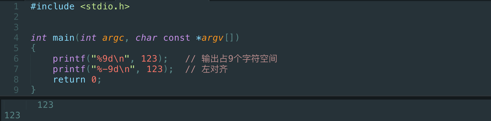

- 输出+

    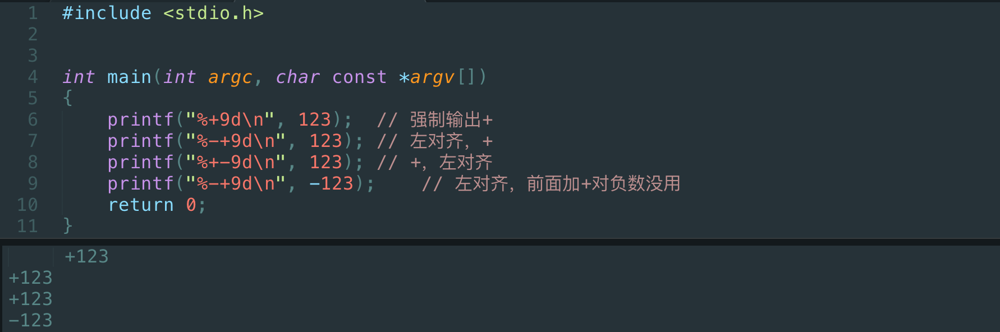

- 0填充

    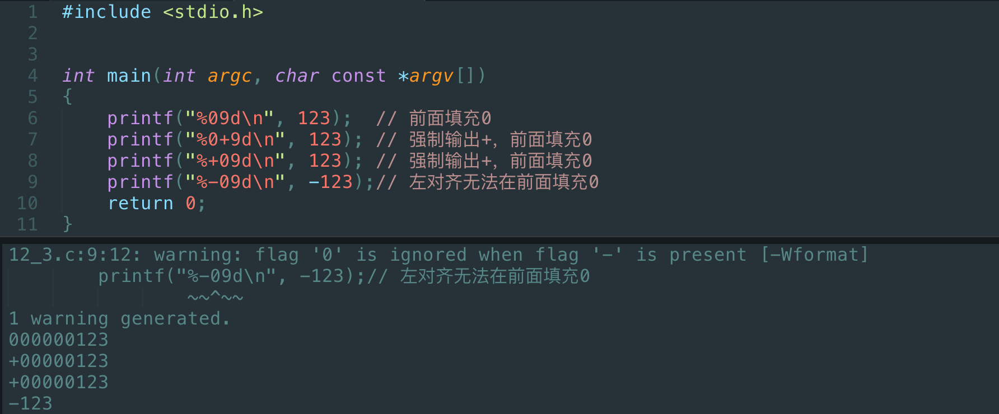

**--width**

| width或prec |             含义              |
| :---------: | :---------------------------: |
|   number    |        输出最小字符数         |
|      *      |   *处被填充的数为输出字符数   |
|   .number   |        小数点后的位数         |
|     .*      | *处被填充的数为小数点后的位数 |

- `.number`

    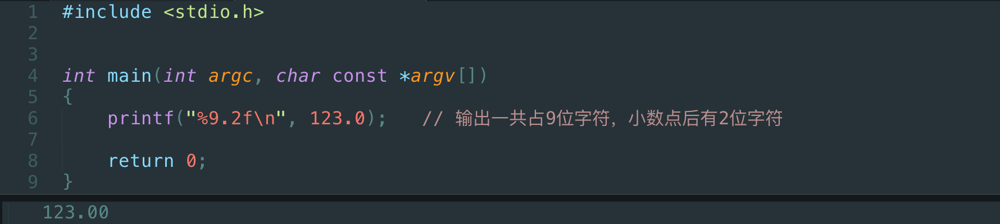

- `*` 和 `.*`

    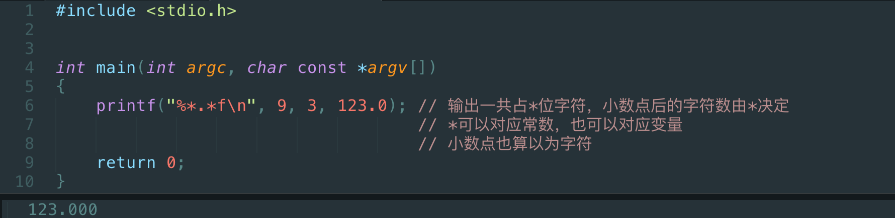

**--hlL(修饰符)**

| 类型修饰 |    含义     |
| :------: | :---------: |
|    hh    |  单个字节   |
|    h     |    short    |
|    l     |    long     |
|    ll    |  long long  |
|    L     | long double |

- hh

    

**--type**

| type |        用于        | type |      用于       |
| :--: | :----------------: | :--: | :-------------: |
| i或d |        int         |  g   |      float      |
|  u   |    unsigned int    |  G   |      float      |
|  o   |       八进制       | a或A | 十六进制浮点数  |
|  x   |      十六进制      |  c   |      char       |
|  X   | 大写字母的十六进制 |  s   |     字符串      |
| f或F |       float        |  p   |    指针地址     |
| e或E |        指数        |  n   | 读入/写出的个数 |

- n

    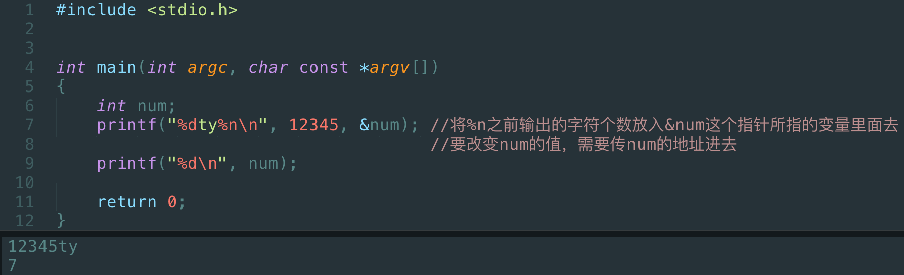

    - 和`scanf()`同理

##### scanf

`%[flag]type`

**--flag**

| flag |      含义      | flag |     含义     |
| :--: | :------------: | :--: | :----------: |
|  *   |      跳过      |  l   | long，double |
| 数字 | 最大输入字符数 |  ll  |  long long   |
|  hh  |      char      |  L   | long double  |
|  h   |     short      |      |              |

- `*`

    ```c
    #include <stdio.h>
    
    int main(int argc, char const *argv[])
    {
    	int num;
    	scanf("%*d%d", &num);	// 跳过第一个d
    	printf("%d\n", num);	
    
    	return 0;
    }
    ```

    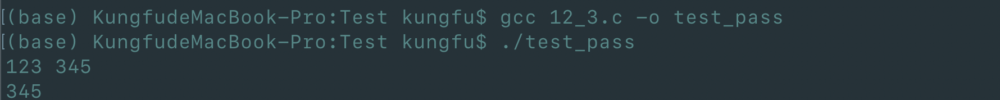

    - `gcc 12_3.c -o test_pass` ：编译12_3.c，编译后的文件叫做test_pass

**--type**

| type | 用于                         | type       | 用于           |
| :--: | ---------------------------- | ---------- | -------------- |
|  d   | int                          | a，e，f，g | float          |
|  i   | 整数，可能为十六进制或八进制 | c          | char           |
|  u   | unsigned int                 | s          | 字符串（单词） |
|  o   | 八进制                       | […]        | 所允许的字符   |
|  x   | 十六进制                     | p          | 指针           |

- `i`

    ```c
    #include <stdio.h>
    
    int main(int argc, char const *argv[])
    {
    	int num;
    	scanf("%i", &num);
    	printf("%d\n", num);	
    
    	return 0;
    }
    ```

    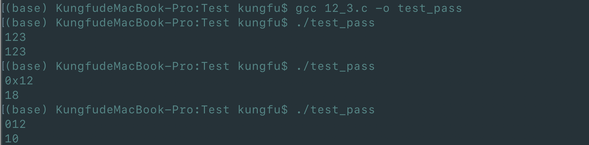

    - 分别以十进制，十六进制，八进制读入；以十进制输出

- `[…]`

    如：`[^,]` ：读入 `,`之前的所有东西

##### printf 和 scanf 的返回值

- 读入的项目数

- 输出的字符数（包括末尾的\n换行，也算一个字符）

    ```c
    #include <stdio.h>
    
    int main(int argc, char const *argv[])
    {
    	int num;
    
    	int i1 = scanf("%i", &num);
    	int i2 = printf("%d\n", num);	
    	printf("i1 = %d\ti2 = %d\n", i1, i2);
    
    	return 0;
    }
    ```

    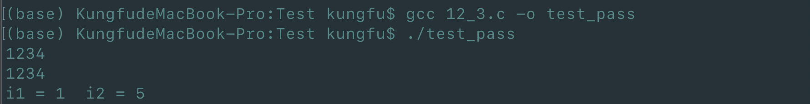

- 在要求严格的程序中，应该判断每次调用scanf或printf的返回值，从而了解程序运行中是否存在问题

#### 文件输入输出

##### 重定向

```c
#include <stdio.h>

int main(int argc, char const *argv[])
{
	int num;

	int i1 = scanf("%i", &num);
	int i2 = printf("%d\n", num);	
	printf("i1 = %d\ti2 = %d\n", i1, i2);

	return 0;
}
```

- 运行test，读取数据，并将输出结果保存在12.out里面

    

- 打开12.out

    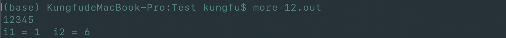

- 将输入结果放在12.in里面

    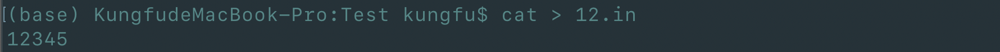

- 运行test，将文件12.in里面的内容输入，并得到输出结果

    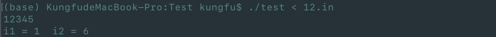

- 运行test，将文件12.in里面的内容输入，并将输出结果放在12.out里面

    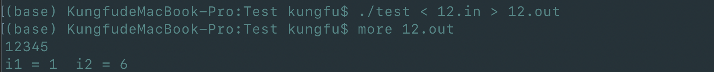

##### FILE

**打开文件的标准代码**

```c
FILE *fp = fopen("file", "r"); // 打开文件，用来读，如果没有打开文件，返回NULL
if (fp) {
    fscanf(fp, …);
    fclose(fp);
} else {
    …
}
```

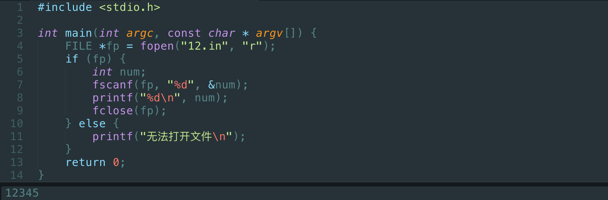

- 12.in里面存放的是12345
- 删除12.in

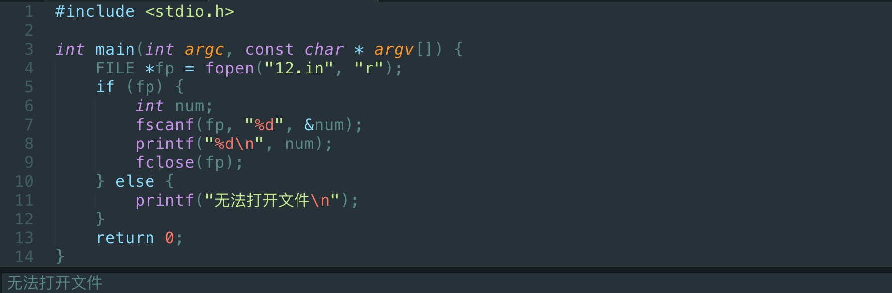

##### fopen

| 符号 |                         含义                         |
| :--: | :--------------------------------------------------: |
|  r   |                    打开文件，只读                    |
|  r+  |                打开读写，从文件头开始                |
|  w   |   打开只写；如果不存在则新建，如果存在则原来的清空   |
|  w+  |   打开读写；如果不存在则新建，如果存在则原来的清空   |
|  a   | 打开追加；如果不存在则新建，如果存在则原来的末尾添加 |
|  x   | 加在上面符号的后面，只新建，如果文件已存在则不能打开 |

#### 二进制文件

- 其实所有的文件最终都是二进制
- 文本文件无非是用最简单的方式可以读写的文件
    - more、tail
    - cat
    - vi
- 而二进制文件是需要专门的城程序来读写的文件
- 文本文件的输入输出是格式化，可能经过转码

##### 文本文件 VS 二进制文件

- Unix喜欢用文本文件来做数据存储和程序配置
    - 交互式终端的出现使得人们喜欢用文本和计算机“talk”
    - unix的shell提供了一些读写文本的小程序
- windows喜欢用二进制文件
    - DOS是草根文化，并不继承和熟悉Unix文化
    - PC刚开始的时候能力有限，DOS的能力更有限，二进制更接近底层
- 文本文件
    - 优势：方便人类读写，而且跨平台
    - 缺点：程序输入输出要经过格式化，开销大
- 二进制文件
    - 优势：输入输出直接，程序读写快
    - 缺点：人类读写困难，而且不跨平台
        - int的大小不一致，大小端问题……

##### 程序为什么要文件

- 配置
    - Unix用文本，Windows 用注册表
- 数据
    - 稍微大一点的数据都放在数据库
- 媒体
    - 图片，声音，视频等
    - 这些只能是二进制的
- 现实是，程序通过第三方库来写文件，调用函数把数据都装载到内存中，然后去做输出使用，很少直接读二进制文件

##### 二进制读写

- 读
    - `size_t fread(void *restrict ptr, size_t size, size_t nitems, FILE *restrict stream);`
        - 第一个参数是指针，指向要读写的内存地址
        - 第二个参数是这块内存的大小/一个结构的大小
        - 第三个参数是有几个这样的内存/结构
        - 第四个参数是文件指针
- 写
    - `size_t fwrite(const void *restrict ptr, size_t size, size_t nitems, FILE *restrict stream);`
        - 
- 注意FILE指针是最后⼀一个参数
- 返回的是成功读写的字节数

##### nitem

- 因为⼆二进制⽂文件的读写一般都是通过对⼀一个结构变量的操作来进⾏行的
- 于是nitem就是⽤用来说明这次读写⼏几个结构变量

**例子**


##### 在文件中定位

- `long ftell(FILE *stream);`

- `int fseek(FILE *stream, long offset, int whence);`

    - SEEK_SET:从头开始 

    - SEEK_CUR:从当前位置开始 

    - SEEK_END:从尾开始(倒过来)

        ```c
        fseek(fp, 0L，SEEK_END)
        ```

##### 可移植性

- 这样的⼆二进制⽂文件不具有可移植性
    - 在int为32位的机器上写成的数据⽂文件⽆无法直接在int 为64位的机器上正确读出

- 解决⽅方案之⼀一是放弃使⽤用int，⽽而是typedef具有明确 ⼤大⼩小的类型

- 更好的⽅方案是⽤用⽂文本

### 13.2 位运算

#### 按位运算

##### `&`：按位的与

- 如果 (x)~i~ == 1 并且 (y)~i~ == 1 ，那么(x & y)~i~ = 1 
- 否则 (x & y)~i~ == 0
- 按位与常用于两种应用：
    - 让某一位或某些位为0：x & 0xFE（11111110），让最后一位变成0
    - 取一个数中的一段：x & 0xFF（00000000 00000000 00000000 11111111），取32位int的最后一段

##### `|`：按位的或

- 如果 (x)~i~ == 1 或 (y)~i~ == 1 ，那么(x | y)~i~ = 1 
- 否则 (x | y)~i~ == 0
- 按位或常用于两种应用：
    - 使得一位或几个位为1：x | 0x01（00000001），让最后一位变成1
    - 把两个数拼起来：0x00FF | 0xFF00，变成0xFFFF

##### `~`：按位取反

- (`~`x)~i~ = 1 - (x)~i~
- 把1变成0，把0变成1
    - 7的二进制是0111，（x | 7）可以使得x低三位变成1
    - （x | ~7），就可以使得x低三位变成0

##### `^`：按位的异或

- 如果 (x)~i~ ==  (y)~i~  ，那么(x ^ y)~i~ == 0 
- 否则 (x ^ y)~i~ == 1
- 如果两个位相等，那么结果为0；不相等，结果为1
- 可以做加密运算

#### 移位运算

##### `<<`：左移

- i << j
    - i中所有位向左移动j个位置，右边填入0
    - 所有小于int的类型，移位都以int的当时来做，结果是int
        - `x <<= 1` 等价于 x *= 2
        - `x <<= n` 等价于 x *= 2^n^

##### `>>`：右移   

- i >> j
    - i中所有位向右移动j个位置
    - 所有小于int的类型，移位都以int的当时来做，结果是int
    - 对于unsigned的类型，左边填入0
    - 对于signed的类型，左边填入原来的最高位（符号保持不变）

- *移位的位数不要用负数

#### 位运算例子

##### 输出一个数的二进制

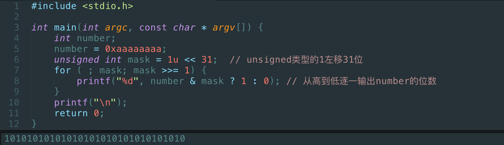

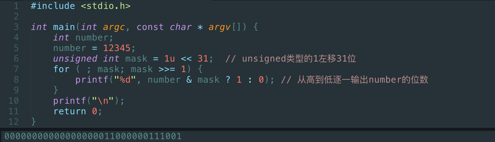

#### 位段

- 把一个int的若干为组合成一个结构

    ```c
    struct {
        unsigned int leading : 3; // 占3个比特
        unsigned int FLAG1 : 1; // 占1个比特
        unsigned int FLAG2 : 1; // 占1个比特
        int trailing : 27; // 占27个比特
    };
    ```

    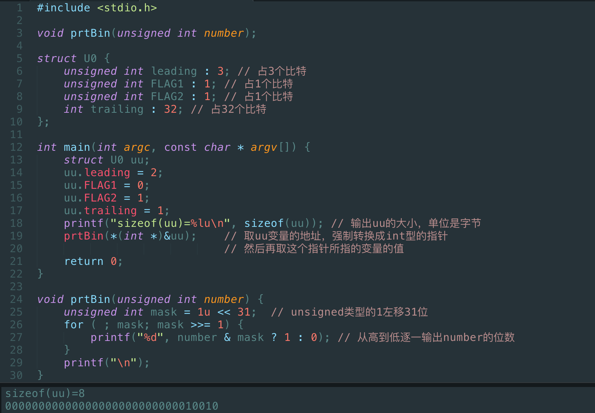

- 可以直接用位段成员的名称来访问

    - 比移位、与、或要方便

- 编译器会安排其中的位的排列，不具有可移植性

- 当所需的位超过一个int是，会采用多个int来存放数据

### 14.1  *可变数组（Resizable Array）

#### the Interface

##### array.h

```c
#ifndef _ARRAY_H_
#define _ARRAY_H_

typedef struct {
    int *array;
    int size;
} Array;

Array array_create(int init_size); // 创建一个数组

void array_free(Array *a);    // 回收数组空间

int array_size(const Array *a);    // 数组里目前有多少单元可以用

int *array_at(Array *a, int index);// 访问数组里下标为index的单元并返回指向index的指针

void array_set( const Array *a, int index, int value);  // 在index处写入value
int array_get(Array *a, int index); // 获得index处的值

void array_inflate(Array *a, int more_size);    // 让数组变大
#endif /* _ARRAY_H_ */
```

##### array.c

```c
#include <stdio.h>
#include <stdlib.h>
#include "array.h"

// 定义一个增长块Block
const int BLOCK_SIZE = 5;

// 创建一个数组
Array array_create(int init_size) {
    Array a;
    a.size = init_size;
    a.array = (int *)malloc(sizeof(int) * a.size);
    return a;
}

// 回收数组空间
// 传入的是指向结构体变量的指针
void array_free(Array *a) {
    free(a->array);
    a->array = NULL;
    a->size = 0;
}

// 数组里目前有多少单元可以用
// 封装，将a->size保护起来了
int array_size(const Array *a) {
    return a->size;
}

// 访问数组里下标为index的单元，并返回指向index的指针
int *array_at(Array *a, int index) {
    // 写数据时，若size溢出，自动增长
    if (index >= a->size) {
        // 找到下一个Block，计算出需要增加的个数more_size
        array_inflate(a, (index / BLOCK_SIZE + 1) * BLOCK_SIZE - a->size);
    }
    return &(a->array[index]); // 返回所在位置的指针
}

// 在index处写入value
void array_set( const Array *a, int index, int value) {
    a->array[index]  = value;
}

// 获得index处的值
int array_get(Array *a, int index) {
    return a->array[index];
}

// 让数组变大
void array_inflate(Array *a, int more_size) {
    int *p = (int *)malloc(sizeof(int) * (a->size + more_size));
    for (int i = 0; i < a->size; i++) {
        p[i] = a->array[i];
    }
    free(a->array);
    a->array = p;
    a->size += more_size;
}
```

##### main.c

```c
#include <stdio.h>
#include "array.h"

int main(int argc, const char * argv[]) {
    Array a = array_create(100);
    printf("size of a = %d\n", array_size(&a));
    
    // 一种访问可变数组a中单元的方法
    array_set(&a, 0, 10);
    printf("value of a->array[0] = %d\n", array_get(&a, 0));
    
    // 另一种访问可变数组a中单元的方法
    *array_at(&a, 1) = 20;
    printf("value of a->array[1] = %d\n", *array_at(&a, 1));
    
    array_free(&a);
    
    return 0;
}
```

- `array_at`返回的指针可以用来向index处赋值和取值

- `array_set`是用来向index处赋值的

- `array_get`是用来在index处取值的

- 他们俩合起来可以实现`array_at`的功能

    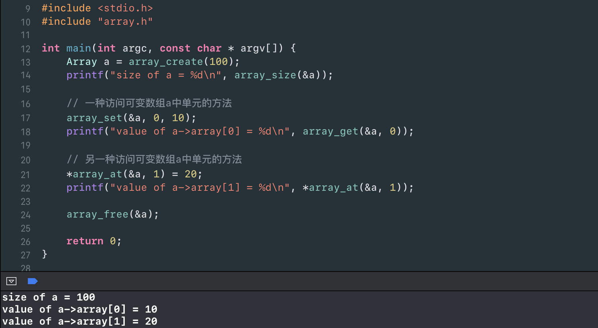

#### 可变数组的缺陷

- it takes time to copy
- it may fail in memory restricted situation ，即可能在有足够内存的情况下无法申请内存

### 14.2 *链表

#### node.h

```c
#ifndef node_h
#define node_h

typedef struct _node {
    int value;
    struct _node *next; // 此时不可以写成Node *next
                        // 因为此时编译器还不知道Node是什么
}Node;

#endif /* node_h */
```

#### main.c

```c
#include <stdio.h>
#include <stdlib.h>
#include "node.h"

// 头结点
typedef struct _list {
    Node *head;
} List;

void add(List *pList, int number);
void print(List *pList);
void find(List *pList, int number);
void delete(List *pList, int number);

int main(int argc, const char * argv[]) {
    List list;
    list.head = NULL;
    int number;
    do {
        scanf("%d", &number);
        if (number != -1) {
            add(&list, number);
        }
    } while (number != -1);
    
    // 遍历输出链表
    print(&list);
    
    // 查找
    find(&list, number);
    
    // 删除
    delete(&list, number);
    
    // free整个链表
    Node *p;
    Node *q = NULL;
    for (p = list.head; p; p = q) {
        q = p->next;
        free(p);
    }
    
    return 0;
}

void add(List *pList, int number) {
    // 申请一个结点存放需要放入的数据
    Node *p = (Node *)malloc(sizeof(Node));
    p->value = number;
    p->next = NULL;
    // 找到最后一个结点
    Node *last = pList->head;
    if (last != NULL) {
        while (last->next != NULL) {
            last = last->next;
        }
        // attach
        last->next = p;
    } else {
        // attach
        pList->head = p;
    }
}

// 输出整个链表
void print(List *pList) {
    Node *p;
       for (p = pList->head; p; p = p->next) {
           printf("%d\t", p->value);
       }
       printf("\n");
}

// 在链表中查找number
void find(List *pList, int number) {
    scanf("%d", &number);
    Node *p;
    int isFound = 0;
    for (p = pList->head; p; p = p->next) {
        if (p->value == number) {
            printf("找到了\n");
            isFound = 1;
            break;
        }
    }
    if (!isFound) {
        printf("没找到\n");
    }
}

// 在链表中删除number
void delete(List *pList, int number) {
    Node *q;
    Node *p;
    for ( q = NULL,p = pList->head; p; q = p, p = p->next) {
        if (p->value == number) {
            if (q) {
                q->next = p->next;
            } else {
                pList->head = p->next; // 删第一个节点，此时q==NULL
            }
            free(p);
            break;
        }
    }
}
```

